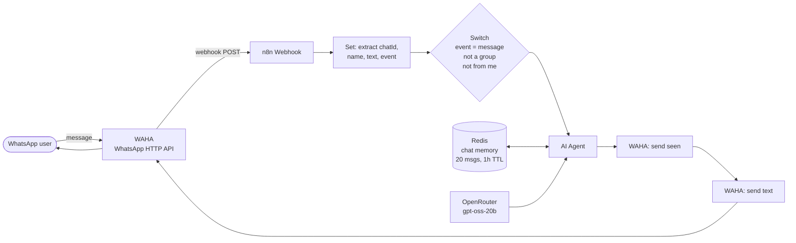

<p align="center">
  
</p>

<p align="center">
  
  
  
  
  
  
</p>

> A WhatsApp number that answers with an LLM, remembers the conversation, and runs on four containers you start with one command.

## What it does

A message arrives on WhatsApp. WAHA turns it into a webhook call, n8n filters it (only real incoming messages, no groups, nothing sent by the bot itself), an AI agent writes the reply using the last 20 messages of that chat as memory, and WAHA marks the message as read and sends the answer back.



## At a glance

| | |
|---|---|
| Channel | WhatsApp through [WAHA](https://waha.devlike.pro/) (GOWS engine) |
| Orchestration | n8n workflow, versioned in [`workflows/whatsapp-ai-agent.json`](workflows/whatsapp-ai-agent.json) |
| Model | OpenRouter `openai/gpt-oss-20b:free`; a Groq `llama-3.1-8b-instant` node is included as a drop-in alternative |
| Memory | Redis, keyed by chat ID, 20-message window, 1 hour TTL |
| Storage | PostgreSQL 16 as the n8n database (workflows, encrypted credentials, executions) |
| Secrets | Only in `.env` and in n8n's encrypted credential store; none in the repository |

## Quickstart

```bash
git clone https://github.com/silvano-moraes-de-souza/n8n-whatsapp-waha.git
cd n8n-whatsapp-waha
cp .env.example .env          # fill in the passwords and keys
docker compose up -d
```

1. Open the WAHA dashboard at `http://localhost:3000`, start the `default` session and scan the QR code with WhatsApp.
2. Open n8n at `http://localhost:5678`, install the community node `n8n-nodes-waha` (Settings → Community nodes).
3. Import `workflows/whatsapp-ai-agent.json` and create the four credentials it references: WAHA account, Redis account, OpenRouter account, Groq account.
4. Activate the workflow and send a message to the connected number.

Both ports are bound to `127.0.0.1`. To expose the webhook or the dashboards, put a reverse proxy with TLS in front of them.

## Engineering decisions

| Decision | Alternative | Why |
|---|---|---|
| WAHA as the WhatsApp gateway | Official WhatsApp Cloud API | Runs locally with no Meta business verification, which is fine for a personal assistant or a prototype. For a business account at scale, the Cloud API is the right choice. |
| n8n for orchestration | Custom Python service | The flow (filter, call a model, reply) changes often. In n8n that is a visual edit, and the workflow is still exported to JSON and versioned here. |
| Filter before the agent | Let the model ignore unwanted messages | Groups, status updates and the bot's own messages never reach the LLM, so they cost nothing and can't trigger reply loops. |
| Redis memory keyed by chat ID | No memory, or Postgres | Each chat has its own context, it expires by itself after an hour of silence, and reads are fast enough for a chat reply. |
| Model behind an n8n credential | Hard-coded provider | Switching OpenRouter for Groq (or any other provider) is rewiring one node. |
| Postgres as the n8n database | n8n's default SQLite file | The state lives in a named volume instead of a file inside the project folder, which is how a SQLite database once ended up committed here. |

## Security notes

- `.env` and every runtime folder (sessions, databases, logs) are gitignored.
- `N8N_ENCRYPTION_KEY` encrypts credentials inside n8n. The database is only readable together with that key, so keep them apart and back the key up.
- WAHA's API and dashboard are protected by `WAHA_API_KEY` and bound to localhost.
- The system prompt tells the model never to ask for passwords, card numbers or documents.

## Limitations

- Text only. Audio, images and documents reach the webhook but are not handled by the workflow yet.
- WAHA and n8n use the `latest` image tags. Pin versions before running this anywhere that matters.
- There is no handoff to a human agent. The prompt offers to forward the question, but nothing routes it.
- No automated tests. The workflow is checked by running it end to end.

## Next steps

- Transcribe voice notes before sending them to the agent
- Tools for the agent (calendar, order lookup) through n8n sub-workflows
- Handoff to a human when the model is not confident

## Author

**Silvano Moraes de Souza**, Software Engineer · Python, APIs, automation and data in production
[LinkedIn](https://www.linkedin.com/in/silvano-moraes-de-souza) · [Portfolio](https://silvanomsouza.vercel.app/) · [GitHub](https://github.com/silvano-moraes-de-souza)
